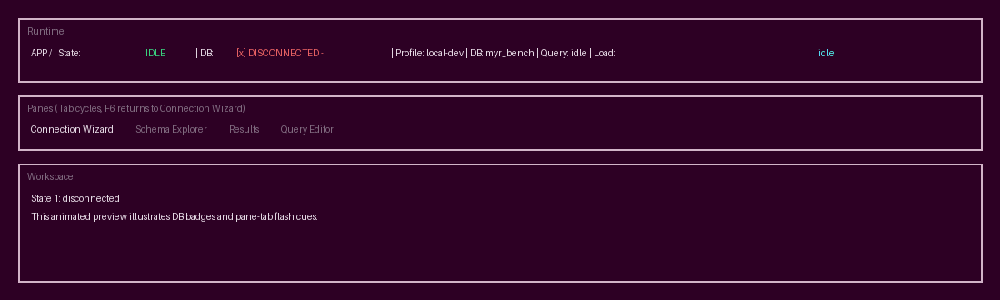

# Fast MySQL TUI Explorer (Rust)

Terminal-first MySQL/MariaDB schema and data explorer focused on speed, guided actions, and safe defaults.

## Status

M0-M7 roadmap milestones are implemented for explorer/navigation, guided actions, reliability,
query UX, and security hardening. Current and upcoming milestone tracking is in `docs/roadmap.md`.

## Workspace Layout

- `app`: binary entrypoint
- `crates/core`: domain logic and shared state
- `crates/tui`: terminal UI components
- `crates/adapters`: external integrations (DB/export/fs)
- `docs`: architecture and contributor docs
- `bench`: benchmark and dataset tooling

## Getting Started

1. Install Rust via `rustup`.
2. Run `cargo build` from the repository root.
3. Run `cargo test` to verify baseline health.
4. Start the app with `cargo run -p myr-app`.

## Key Features

- Connection wizard with persisted profiles
- Schema explorer lanes for databases, tables, and columns
- Runtime status strip with animated app heartbeat + DB state (`[x]` disconnected, `[~]` connecting, `[+]` connected)
- Pane tabs with active-pane flash animation on tab/view changes
- Context-aware next actions in footer + command palette
- Safe mode confirmation for destructive SQL
- Optional secure password retrieval via OS keyring (`password_source = keyring`) with env fallback
- Expanded TLS profile options (mode + CA/client cert/client key + verification toggles)
- Read-only profile mode guard (blocks write/DDL SQL when enabled)
- SQL audit trail (`audit.ndjson`) with timestamp/profile/database/outcome metadata
- Error panel with reconnect/retry guidance and auto-reconnect path for transient disconnects
- Results search mode with buffered match navigation
- Query editor upgrades: multiline editing, cursor movement, and query history recall
- Guided query actions: server-side filter/sort builder, EXPLAIN preflight, and SQL snippets
- Table preview pagination:
  - Keyset pagination for detected `id` / `*_id` keys
  - OFFSET fallback when keyset is unavailable
- Export to CSV/JSON
- Benchmark runner + perf smoke checks

## Visual Status Cues

## MySQL Connection Notes

- Connection profiles in the TUI now attempt real MySQL connections via `mysql_async`.
- Password retrieval supports:
  - `password_source = env_var` (default, reads `MYR_DB_PASSWORD`)
  - `password_source = keyring` (reads keyring first, falls back to env and stores on success)
- Schema/table loading and query execution use the live adapter when connected.
- TLS options are profile-driven (`tls_mode`, optional CA/client cert/client key, verification toggles).
- Table preview now supports paging actions: keyset pagination on detected `id`/`*_id` columns with OFFSET fallback.
- Query executions append audit entries to `~/.config/myr/audit.ndjson` (or `$MYR_CONFIG_DIR/myr/audit.ndjson`).

## Benchmark Quickstart

- Start local benchmark DB: `docker compose -f bench/docker-compose.yml up -d --wait`
- Run benchmark runner:
  - `MYR_DB_PASSWORD=root cargo run -p myr-app --bin benchmark -- --host 127.0.0.1 --port 33306 --user root --database myr_bench --seed-rows 50000`
- One-command setup/run/teardown:
  - `bench/scripts/run_benchmark.sh`
- One-command local connection test dataset:
  - `scripts/dev-db-seed.sh`

## Manual Testing

- Manual smoke checklist and expected outcomes:
  - `docs/manual-testing.md`
- Quick seed + run path:
  - `scripts/dev-db-seed.sh`
  - `export MYR_DB_PASSWORD=root`
  - `cargo run -p myr-app`

## Quality Gates

- Local baseline:
  - `cargo fmt --check`
  - `cargo clippy --all-targets --all-features -- -D warnings`
  - `cargo test`
  - `cargo build`
- Coverage report:
  - `cargo llvm-cov --workspace --all-features --html --output-dir target/coverage/html`
- CI coverage gate:
  - minimum lines: `80%`
  - MySQL-backed integration tests enabled via `MYR_RUN_MYSQL_INTEGRATION=1`
  - TUI MySQL integration gate enabled via `MYR_RUN_TUI_MYSQL_INTEGRATION=1`
  - see `.github/workflows/ci.yml`
- CI cross-platform validation:
  - test + build on `ubuntu-latest`, `macos-latest`, and `windows-latest`
- Run MySQL integration tests locally (optional):
  - `MYR_DB_PASSWORD=root MYR_RUN_MYSQL_INTEGRATION=1 cargo test -p myr-adapters --test mysql_integration`
- Additional quality docs:
  - `docs/quality.md`

## License

MIT (`LICENSE`).
