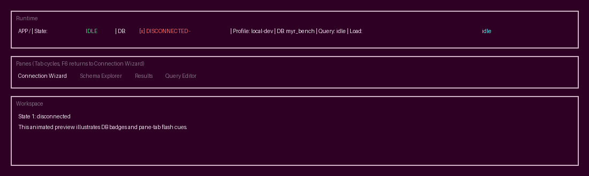

# myr — MySQL/MariaDB Explorer

Native GUI, terminal UI, and scripting CLI for exploring MySQL/MariaDB with typed results, guided actions, and safe defaults.

## Status

M0-M8 roadmap milestones are implemented for explorer/navigation, guided actions, reliability,
query UX, and security hardening. Current and upcoming milestone tracking is in `docs/roadmap.md`.

## Workspace Layout

- `app`: binary entrypoint
- `gui-app`: Linux GUI binary entrypoint (`myr-gui`)
- `crates/application`: shared command/event actor and UI-independent snapshots
- `crates/gui`: Iced 0.14 presentation library
- `crates/core`: domain logic and shared state
- `crates/tui`: terminal UI components
- `crates/adapters`: external integrations (DB/export/fs)
- `docs`: architecture and contributor docs
- `bench`: benchmark and dataset tooling

## Getting Started

1. Install Rust via `rustup`.
2. Run `cargo build` from the repository root.
3. Run `cargo test` to verify baseline health.
4. Start the app with `cargo run -p myr-app`.
5. View non-interactive CLI help with `cargo run -p myr-app -- --help`.
6. Start the native GUI with `cargo run -p myr-gui-app --bin myr-gui`.

## Install Channels

Homebrew tap:

```bash
brew tap juanicastellan0/myr
brew install myr
```

Scoop bucket:

```powershell
scoop bucket add myr https://github.com/juanicastellan0/myr
scoop install myr/myr
```

Notes:
- The installed executable is `myr-app`.
- Both channels currently install from source (`rust`/`rustup` is required).

## Key Features

- Native Iced GUI with profile/connection toolbar, lazy schema sidebar, Schema/Query/Results tabs, typed table, buffered search, and progress/error footer
- One shared Tokio application actor for GUI and the composed TUI, with operation IDs, cancellation, stale-response rejection, and 10 Hz streaming updates
- Typed query values (`NULL`, signed/unsigned integers, floats, text, bytes, date-time, and time) while preserving existing textual CLI/TUI output
- Scoped schema loading: connect loads databases only; selecting a database loads tables; selecting a table loads columns and relationships
- Connection wizard with persisted profiles
- Versioned profile config with automatic legacy-key migration on load
- Schema explorer lanes for databases, tables, and columns
- Schema Explorer filter-as-you-type plus compact/full column metadata toggle (`F4`)
- Runtime status strip with animated app heartbeat + DB state (`[x]` disconnected, `[~]` connecting, `[+]` connected)
- Pane tabs with active-pane flash animation on tab/view changes
- Context-aware next actions in footer + command palette
- Safe mode confirmation for destructive SQL
- Optional secure password retrieval via OS keyring (`password_source = keyring`) with env fallback
- Expanded TLS profile options (mode + CA/client cert/client key + verification toggles)
- Read-only profile mode guard (blocks write/DDL SQL when enabled)
- SQL audit trail (`audit.ndjson`) with timestamp/profile/database/outcome metadata and retention rotation
- Error panel with reconnect/retry guidance and auto-reconnect path for transient disconnects
- Health diagnostics action (`health`/`doctor` in palette) for connection + schema + query smoke checks
- Results search mode with buffered match navigation
- Query editor upgrades: multiline editing, explicit cursor ruler + SQL region emphasis, long-query viewporting, and query history recall
- Guided query actions: server-side filter/sort builder, EXPLAIN preflight, and SQL snippets
- Foreign-key relationship navigation action to jump across related tables
- Saved bookmarks for schema targets + query text (persisted in `bookmarks.toml`)
- Profiles/bookmarks manager screen with list/open/delete/rename workflows
- Default profile + quick reconnect markers managed directly in the manager (`d` / `q`)
- Table preview pagination:
  - Keyset pagination for detected `id` / `*_id` keys
  - OFFSET fallback when keyset is unavailable
- Export to streaming CSV/JSON plus JSONL and gzip variants
- Non-interactive scripting entrypoints:
  - `myr-app query --sql ...`
  - `myr-app export --sql ... --format ... --output ...`
  - `myr-app doctor`
- Optional `--typed-values` for query JSONL and JSON/JSONL exports (default output stays backwards-compatible)
- Benchmark runner + CI perf smoke checks with persisted perf metric artifacts and trend-policy guardrails

## Visual Status Cues



## MySQL Connection Notes

- Connection profiles in the TUI now attempt real MySQL connections via `mysql_async`.
- Password retrieval supports:
  - `password_source = env_var` (default, reads `MYR_DB_PASSWORD`)
  - `password_source = keyring` (reads keyring first, falls back to env and stores on success)
- Schema/table loading and query execution use the live adapter when connected.
- TLS options are profile-driven (`tls_mode`, optional CA/client cert/client key, verification toggles).
- Profile config upgrades are migration-backed (`version = 1` is auto-written for legacy files).
- Table preview now supports paging actions: keyset pagination on detected `id`/`*_id` columns with OFFSET fallback.
- Query executions append audit entries to `~/.config/myr/audit.ndjson` (or `$MYR_CONFIG_DIR/myr/audit.ndjson`).
- Audit retention defaults:
  - `MYR_AUDIT_MAX_BYTES` (default `5242880`, 5 MiB before rotate)
  - `MYR_AUDIT_MAX_ARCHIVES` (default `3` rotated files)

## Benchmark Quickstart

- Start local benchmark DB: `docker compose -f bench/docker-compose.yml up -d --wait`
- Run benchmark runner:
  - `MYR_DB_PASSWORD=root cargo run -p myr-app --bin benchmark -- --host 127.0.0.1 --port 33306 --user root --database myr_bench --seed-rows 50000`
- Run benchmark with trend policy checks:
  - `MYR_DB_PASSWORD=root cargo run -p myr-app --bin benchmark -- --host 127.0.0.1 --port 33306 --user root --database myr_bench --seed-rows 10000 --trend-policy bench/perf-trend-policy.json`
- One-command setup/run/teardown:
  - `bench/scripts/run_benchmark.sh`
- One-command local connection test dataset:
  - `scripts/dev-db-seed.sh`

## Non-Interactive CLI

Query rows as JSON Lines (`stdout`):

```bash
MYR_DB_PASSWORD=root cargo run -p myr-app -- \
  query \
  --host 127.0.0.1 \
  --port 33306 \
  --user root \
  --database myr_bench \
  --sql "SELECT id, email FROM \`myr_bench\`.\`users\` ORDER BY id LIMIT 3"
```

Add `--typed-values` to preserve JSON numbers and `null`; binary values are emitted as explicit hex objects.

## Native GUI Alpha

`v0.2.0-alpha.1` targets Linux x86_64. Release assets include:

- `myr-gui-0.2.0-alpha.1-linux-x86_64.AppImage`
- `myr-gui-0.2.0-alpha.1-linux-x86_64.tar.gz`
- `SHA256SUMS.txt`

GUI-only preferences are stored in `gui.toml`. Profiles, keyring credentials, and audit data remain shared with TUI/CLI. “Export loaded rows” writes exactly the bounded result buffer; “Export full read query” re-runs only safe read SQL, streams through `destination.part`, and renames on success.

Export query results:

```bash
MYR_DB_PASSWORD=root cargo run -p myr-app -- \
  export \
  --host 127.0.0.1 \
  --port 33306 \
  --user root \
  --database myr_bench \
  --sql "SELECT id, category, payload FROM \`myr_bench\`.\`events\` ORDER BY id LIMIT 200" \
  --format jsonl.gz \
  --output /tmp/events.jsonl.gz
```

Run diagnostics (`connection + schema + query smoke`):

```bash
MYR_DB_PASSWORD=root cargo run -p myr-app -- \
  doctor \
  --host 127.0.0.1 \
  --port 33306 \
  --user root \
  --database myr_bench
```

## Manual Testing

- Manual smoke checklist and expected outcomes:
  - `docs/manual-testing.md`
- Quick seed + run path:
  - `scripts/dev-db-seed.sh`
  - Seeds a richer relational graph (`users/sessions/tracks/playlists/events`) for relationship and join testing
  - `export MYR_DB_PASSWORD=root`
  - `cargo run -p myr-app`

## Quality Gates

- Local baseline:
  - `cargo fmt --check`
  - `cargo clippy --all-targets --all-features -- -D warnings`
  - `cargo test`
  - `cargo build`
- Coverage report:
  - `cargo llvm-cov --workspace --all-features --html --output-dir target/coverage/html`
- CI coverage gate:
  - shared-application baseline: `80%` (`80.79%` measured locally with the CI-equivalent MySQL suites); ratchets to `85%` before the alpha tag
  - MySQL-backed integration tests enabled via `MYR_RUN_MYSQL_INTEGRATION=1`
  - MariaDB compatibility lane runs `myr-adapters` integration test suite on `mariadb:11.4`
  - TUI MySQL integration gate enabled via `MYR_RUN_TUI_MYSQL_INTEGRATION=1`
  - optional cross-platform keyring smoke checks are enabled when repository variable `MYR_CI_RUN_KEYRING_SMOKE=1`
  - see `.github/workflows/ci.yml`
- CI cross-platform validation:
  - test + build on `ubuntu-latest`, `macos-latest`, and `windows-latest`
- Run adapter integration tests locally (optional):
  - `MYR_DB_PASSWORD=root MYR_RUN_MYSQL_INTEGRATION=1 cargo test -p myr-adapters --test mysql_integration`
- Additional quality docs:
  - `docs/quality.md`

## License

MIT (`LICENSE`).
